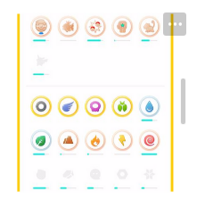
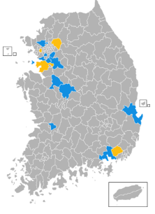
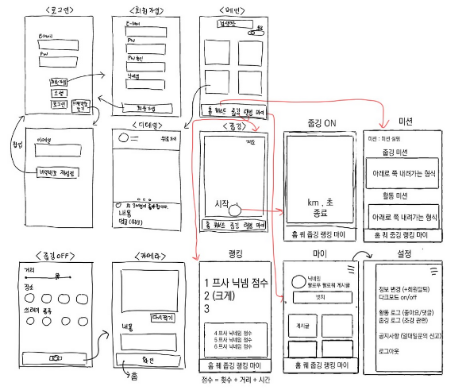

# 프로젝트 계획서

1. 서비스 1줄 요약

   (핵심가치 : 환경, 조깅, 운동, 건강, 주변환경, 쾌적,  동참, 챌린지, 게이미피케이션, 가치, 지킴이, 동네)

   - 환경을 위한 줍깅(조깅+쓰레기 줍기) 활동을 유저들과 공유하고, 미션을 통해 쉽게 참여할 수 있는 서비스

2. 프로젝트 명

   - 줍깅 (Jubging)

3. 프로젝트 기획 배경

   - 환경에 대한 관심이 계속해서 증가하면서, 실제 생활속에서 환경보호를 실천할 수 있는 방법이 있을까 생각했다. 조깅을 하며 쓰레기를 줍는 환경보호운동은 간단하면서도 우리 생활속에서 쉽게 실천할 수 있어 많은 사람들이 동참할 수 있을것이라고 생각하여, (쓰레기를 줍는다 + 조깅)의 합성어인 '줍깅'이라는 서비스를 기획하게 됐다. 줍깅 서비스를 이용해 길가에 버려진 쓰레기를 주우면서 굽히는 동작, 스쿼트 동작, 러닝을 하며 운동과 환경보호의 일석이조의 효과 & SNS 형태의 서비스로 다른 사람들의 동참을 촉구하는 효과를 기대하고 있다.

4. 프로젝트 상세 소개

   ## 메인피드

   - 모든 유저 / 내가 팔로우 하는 유저들의 게시글을 보는 페이지
   - 구성 : 어떤 피드를 볼것인지에 대한 토글 버튼, 그리드 형식의 사진 피드
   - 사진을 누르면 글쓴이 프로필, 글, 좋아요, 댓글이 나오는 형식
   - 오른쪽 위에 내 게시글 좋아요, 댓글, 팔로우를 알려주는 알람탭

   ## 미션

   - 유저들이 줍깅을 할 때마다 뱃지를 얻을 수 있어 동기부여를 줄 수 있는 서비스
   - 쿼스트에 따라 미션을 완수하면 어떤 뱃지를 얻을 수 있는지 볼 수 있는 페이지
     1. 거리 비례 뱃지 ( 1km , 3km , 5km, ~ )
     2. 장소 뱃지 ( 강, 집 주변, 산, 바다 )
     3. 쓰레기 종류 ( 캔, 플라스틱, 유리, 종이, 일반 등의 비례 )
     4. 팔로우, 팔로워, 좋아요, 댓글 횟수 비례 뱃지
     5. 금주의 좋아요 겟
     6. 한 달간 1일1줍깅 완료 - 며칠 연속, 한 달에 몇 번 했는지, 몇 번 달성(출석체크 느낌 뱃지
     7. 1등, 2등, 3등 순위 뱃지
     8. 뱃지 참고 (금/은/동)
     9. 랭킹 제도 (주차별로)

   

   ## 줍깅

   - 지도 기반으로 줍깅을 시작할 수 있는 페이지
   - 지도 상에 가장 가까운 산책로 3곳을 퀵마커 형태로 표시해줌 (추천 코스)
   - 줍깅 프로세스
     1. 줍깅시작
        1. 빈 봉투( 종량제/검봉/흰봉/파란봉 인식 )
        2. 거리 시간 지도 밑 종료 옆 표시
     2. 종료
     3. 총 거리 / 장소 / 쓰레기 종류 체크
        1. 양심상 제대로 했는지 alert
     4. 피드에 올릴 사진(갤러리,찍기) 및 글 쓰기
   - 시간, 경로, km수, 위치 등 사진 필터 생성 ( + 위치 및 요소 커스텀 (가능하면
   - 지도 api + 시작 버튼을 누르고 자신의 조깅한 경로와 km수 수집
   - 본인이 줍깅한 코스 스샷 과 주은 쓰레기봉투 사진 올리기 (메인 기능)

   ## 랭킹

   - 주차별 유저 랭킹, 지도 랭킹을 확인할 수 있는 페이지
   - 구성 : 유저 랭킹, 지도 랭킹

   1. 유저 랭킹

      - 점수 산정 :  횟수(1회 당 몇점) + 거리(10m 당 몇점) + 시간 (1분 당 몇점)
      - 주차 별 랭킹 갱신
      - 프로필 사진 + 닉네임 + 점수 표시 1,2,3등 크게 나머지 밑에

   2. 지도 랭킹

      - 지도 분할(도 별)한 후 많이 한 만큼 지도 색 진하게 표시

        

   ## 마이페이지(개인피드)

   - 개인 프로필, 게시글을 볼 수 있고 개인 정보를 수정하는 페이지
   - 구성 : 메뉴바 (개인정보 수정) , 프로필 파트, 뱃지리스트, 게시글(그리드)

   1. 개인피드
      - 프로필, 팔로우, 팔로워, 게시글 수
      - 뱃지 리스트
      - 게시글(그리드형식)
      - 게시물 눌렀을때 상세페이지
        - 사진, 내용
        - 댓글
          - @ 이용해서 유저 댓글에서 언급하는 식
          - 팔로우한 유저들 자동검색
          - 특정 유저를 선택하면 댓글창에 @user 작성해주기
          - 좋아요X, 답글X
   2. 개인정보 수정
      - 정보 수정 ( 비밀번호 변경 / 닉네임 변경 / 프로필 사진 변경 )
      - 좋아요 로그 (좋아요 누른 게시글 확인)
      - 조깅 로그
      - 회원 탈퇴
      - 로그아웃

5. 상세 화면 및 서비스 흐름 구성 (손으로 그려서 사진찍어 붙이세요)

   

6. 수익 모델 or 상용 서비스로써의 가치 분석

   - 환경 개선을 통한 시민 의식 발전
   - 지자체의 환경 발전에 이바지

7. 개발일정 수립 (로그인, 회원가입, 메인, 미션, 줍깅, 랭킹, 마이)

   [개발일정](https://www.notion.so/2df21714bdd7468eb615344bec7b8ac6)

8. 기술스택

   - Back : Spring, java
   - Front : Vue
   - Devops : docker, jenkins
   - Server : AWS
   - DB : mariaDB

9. 팀 이름

   - 마니또

10. 팀 구성원 소개

   - Front : 박선주 / 문학일 / 이다은
   - Back : 김하정 / 이수정
   - App : 문학일

11. 개인별 업무 분장 계획

    - 선주 : 지라+칸트 차트 관리
    - 학일 : 웹뷰(웹앱), GIT 마스터
    - 다은 :  UI / UX 디자인
    - 수정 :  UI / UX 디자인
    - 하정 : 기능명세서, GIT 마스터

feature/jubging

<<<<<<< HEAD
feature/login
=======
feature/main
>>>>>>> eb7a8307fbf0d128a0c88d271aa6b3acbf743cbd
