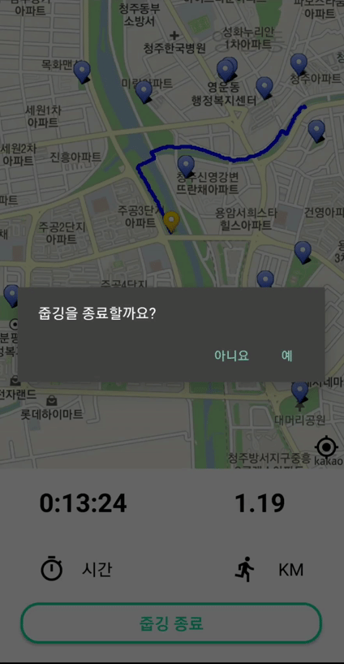

줍깅 | JUBGING 🌎
=============

- 서비스명 : JUBGING 줍깅
- 개발기간 : 2021.07. ~ 2021.8.20
- 팀명 : 마니또 

<br>

# 🏃‍ 서비스 소개

   ### 줍깅이란?
   - 환경을 위한 줍깅(쓰레기 줍기+조깅) 활동을 유저들과 공유하고, 미션을 통해 쉽게 참여할 수 있는 서비스
   - 핵심가치 : 환경, 조깅, 운동, 건강, 주변환경, 동참, 챌린지, 게이미피케이션, 가치

   ### 서비스 기획 배경
   - 조깅을 하며 쓰레기를 줍는 환경보호운동은 간단하면서도 우리 생활속에서 쉽게 실천할 수 있어 많은 사람들이 동참할 수 있을 것이라고 생각하여,     (쓰레기를 줍는다 + 조깅)의 합성어인 '줍깅'이라는 서비스를 기획
   - 환경에 대한 관심이 계속해서 증가하고 있어 서비스를 SNS 형태로 제공하여 다른 사람들의 동참을 촉구하는 효과를 기대

<br>

# 👩 팀원 역할
| 팀원 | 역할 | 담당 업무
| ------ | ------ | ------ |
| 박선주 | 팀장 | 프론트엔드 개발, PM(JIRA 관리), DB설계, 기능명세서 |
| 김하정 | 팀원 | 백엔드 개발, S3, DB설계, 기능명세서 |
| 문학일 | 팀원 | 프론트엔드 개발, Android, DB설계, 기능명세서 |
| 이다은 | 팀원 | 프론트엔드 개발, UI/UX, QA |
| 이수정 | 팀원 | 백엔드 개발, UI/UX, CI/CD |

<br>

# 💻 기술 스택
> ### Front : Vue.js , Android , html, scss , javascript
> ### Back : Spring, java
> ### Devops : docker, jenkins, nginx
> ### Server : AWS, S3
> ### DB : mariaDB

<br>

# 🌎 주요 기능

   * ## 메인피드
   > + ##### 모든 유저 / 내가 팔로우 하는 유저들의 게시글을 보는 페이지
   > + ##### (상단) 토글버튼, 알림탭, 검색버튼, (메인)그리드 형식의 사진 피드
   > + ##### 사진을 누르면 해당 게시글의 상세 조회로 이동
   > + ##### 토글버튼 클릭시, 팔로우한 유저들의 게시글 조회

<br>

   * ## 게시글
   > + ##### 사진과 게시글 내용, 좋아요, 댓글쓰기 기능
   > + ##### 댓글 - 등록, 삭제

<br>

   * ## 검색기능
   > + ##### 유저 검색, 해시태그 검색

<br>

   * ## 줍깅
   > + ##### 지도 기반으로 줍깅을 시작할 수 있는 페이지
   > + ##### 줍깅에 사용할 쓰레기봉투 인증 기능
   > + ##### 지도 api로 현재 위치 표시 및 주변에 있는 공원이나 산책로 표시
   > + ##### 조깅한 경로를 트래킹하고 시간, km를 계산하여 제공
      줍깅 프로세스
         1. 줍깅시작
              1. 빈 봉투( 검정봉투 인식 )
              2. 거리 시간 지도 밑 종료 옆 표시
         2. 줍깅 ON
            1. 이동 경로를 지도 위에 표시
            2. 시간, 거리 표시
         3. 줍깅 OFF
         4. km, 시간을 확인 / 쓰레기 종류 체크
         5. 피드에 올릴 사진(갤러리,카메라) 및 글 쓰기
<br>

   * ## 미션
   > + ##### 쿼스트에 따라 미션을 완수하면 어떤 뱃지를 얻을 수 있는지 볼 수 있는 페이지
   > + ##### 유저들이 줍깅을 하면 뱃지를 얻을 수 있어 동기부여를 줄 수 있는 서비스 (게이미피케이션 접목)
   > + ##### 줍깅 미션(줍깅 활동), 활동미션(SNS활동)
     [줍깅 미션]
     1. 거리 비례 뱃지 ( 1km , 3km , 5km, ~ )
     2. 장소 뱃지 ( 강, 집 주변, 산, 바다 )
     3. 쓰레기 종류 ( 캔, 플라스틱, 유리, 종이, 일반 등의 비례 )
     4. 팔로우, 팔로워, 좋아요, 댓글 횟수 비례 뱃지
     5. 1등, 2등, 3등 순위 뱃지
     6. 뱃지 참고 (금/은/동)

<br>

   * ## 랭킹
   > + ##### 활동점수에 따른 유저 랭킹, 지도 랭킹을 확인할 수 있는 페이지
      1. 유저 랭킹
      - 점수 산정 :  횟수(1회 당 몇점) + 거리(10m 당 몇점) + 시간 (1분 당 몇점)
      - 프로필 사진 + 닉네임 + 점수 표시
      - 1,2,3등은 크게, 나머지 밑에

      2. 지도 랭킹
      - 지도 분할(구 별)한 후 줍깅수에 비례하여 지도에 색을 진하게 표시

<br>

   * ## 마이페이지(개인피드)
   > + ##### 개인 프로필, 게시글을 볼 수 있고 개인 정보를 수정하는 페이지
   > + ##### 메뉴바(개인정보 수정/로그/로그아웃), 팔로우 버튼, 프로필, 뱃지리스트, 게시글(그리드)
      1. 개인피드
         - 프로필, 팔로우, 팔로워, 게시글 수
         - 뱃지 리스트
         - 게시글(그리드형식)
      2. 개인정보 수정
         - 정보 수정 ( 비밀번호 변경 / 닉네임 변경 / 프로필 사진 변경 )
         - 줍깅 로그, 좋아요 로그 (좋아요 누른 게시글 확인)
         - 회원 탈퇴
         - 로그아웃

<br><br>

# 📝개발 규칙

   ### ✔Git 규칙
   
   - #### Branch 규칙
      ### ``` develop -> feature/기능명/BE,FE ``` 
      #### ex) feature/login/fe   
   
   - #### Commit 규칙
      ### ``` [ FE / BE ] Git 컨벤션(대문자) : Commit 메시지 ```
      #### ex) [FE] ADD : 로그인 버튼 추가

   <br>

   ### ✔ Naming Rule
   
   - #### 프론트엔드
      > ##### 폴더명 : 소문자
      > ##### 파일명 : Pascal case
      > ##### 변수/함수명 : Camel case

   - #### 백엔드
      > ##### 클래스명 : 첫글자 대문자 + Camel case
      > ##### 변수/함수명 : 첫글자 소문자 + Camel case

   <br>

<br>

# 💻 구현
### [메인화면]
   
> 메인에서는 전체 유저의 게시글을 볼 수 있습니다.  
> 상단에 위치한 토글 버튼을 사용하면 팔로우한 유저의 게시글만 따로 모아 확인할 수 있습니다.  
> (로그인을 하지 않았을 경우에는 전체 유저의 게시글만 볼 수 있으며 토글 버튼은 생기지 않습니다.)


### [게시글]
  
  
> 게시글을 클릭하면 사진과 작성글을 볼 수 있으며, 좋아요 누르기 및 댓글 등록 및 삭제가 가능합니다.

### [검색기능 및 팔로우]  
  
   
> 유저와 해시태그를 검색할 수 있습니다.
> 유저 개인 페이지에서 팔로우를 신청할 수 있고, 팔로우 및 팔로잉 리스트를 확인할 수 있습니다.

### [알림기능]
  
> 댓글 등록, 팔로우, 좋아요에 대한 알람이 실시간으로 전송됩니다.
> 메인 화면의 알림창에서 이전 알림들을 확인할 수 있습니다.

#### [줍깅기능]
  
  
> 줍깅을 시작 전 검정 봉투를 가지고 있는지 인증합니다.  
> 줍깅을 시작하면 이동 경로가 지도에 표시되고, 시간 및 이동 거리를 확인할 수 있습니다.  
> 줍깅이 끝나면 줍깅 활동 기록을 확인하고, 어디서 줍깅을 했는지 그리고 어떤 쓰레기를 주웠는지 체크합니다.  

#### [게시글 작성]
  
> 줍깅을 완료하면 게시글을 작성할 수 있습니다.  
> 카메라 및 갤러리에서 사진 선택이 가능하며, 1:1로 크롭합니다.  

#### [미션 및 랭킹 기능]
  
  
> 미션은 줍깅 활동과 SNS 활동 미션으로 나뉩니다.  
> 줍깅 활동을 하며 획득한 뱃지를 확인할 수 있습니다.  
> 랭킹은 유저 활동 점수 랭킹과 지역 별 줍깅수 랭킹으로 나뉩니다.  

#### [마이페이지]
  
> 마이페이지에서는 개인 피드 및 획득한 뱃지를 확인할 수 있습니다.
> 회원정보 수정이 가능하고, 줍깅 기록과 좋아요 기록을 확인할 수 있습니다.

# 📝 산출물
#### [DB] https://www.notion.so/DB-415189d7c7b943829d32216d39b7df0d  
#### [와이어프레임] https://www.notion.so/DB-415189d7c7b943829d32216d39b7df0d  
#### [기능명세서] https://www.notion.so/a956b3d37f524960aa721233fab1c432  
#### [프로젝트 계획서] https://www.notion.so/0fe9491369fb4f04ada54edf21d12227  
#### [최종 발표 자료 및 UCC] https://drive.google.com/drive/folders/1TGs6Q2QL1dhRx-PeGWbAz5Id3Dnn5xnw?usp=sharing  
